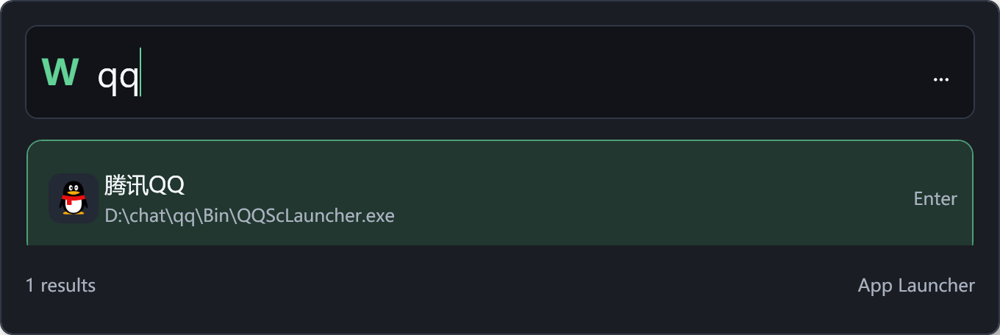
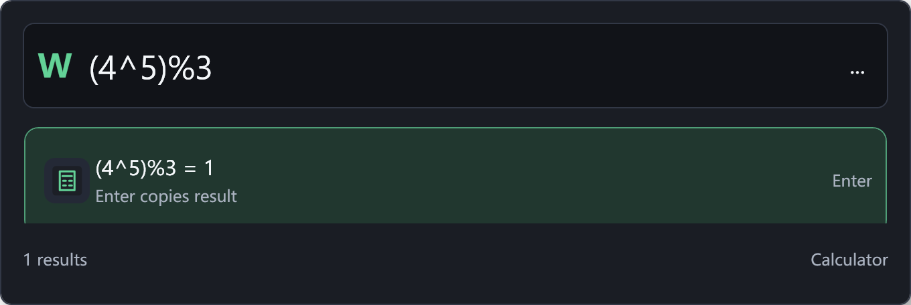
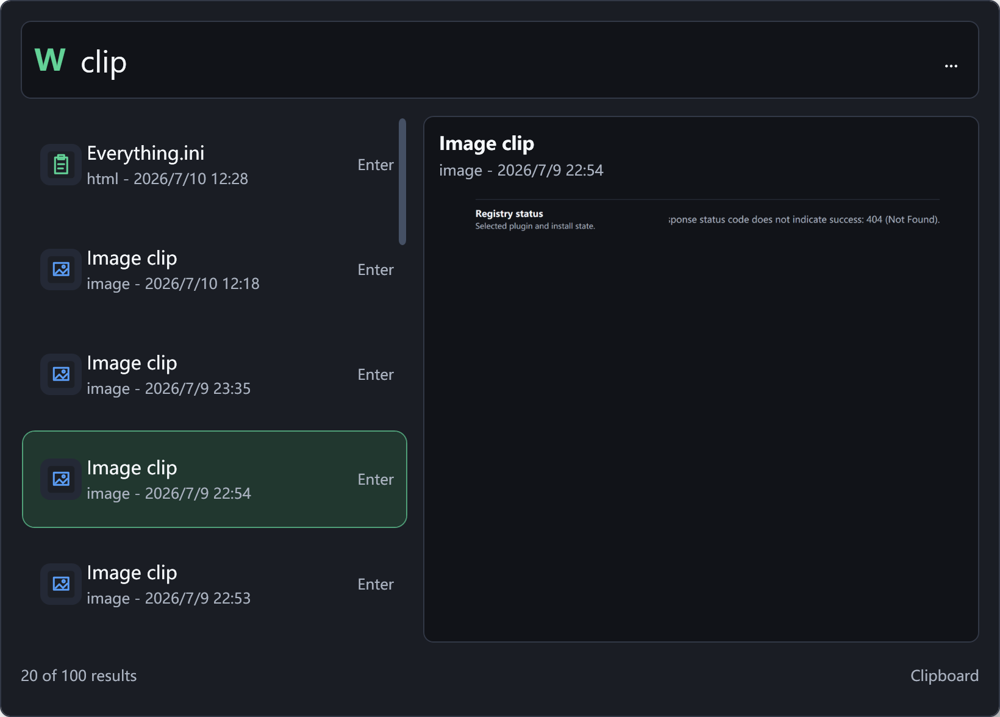
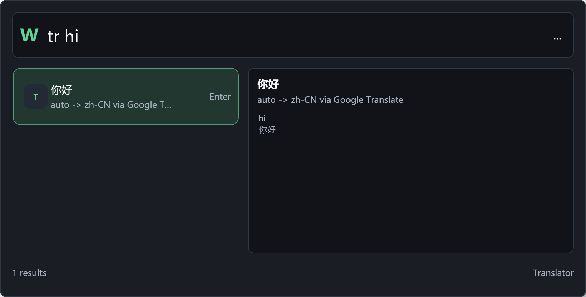
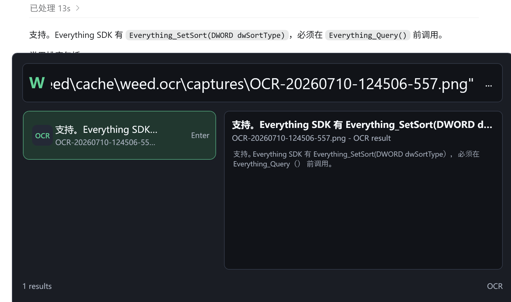
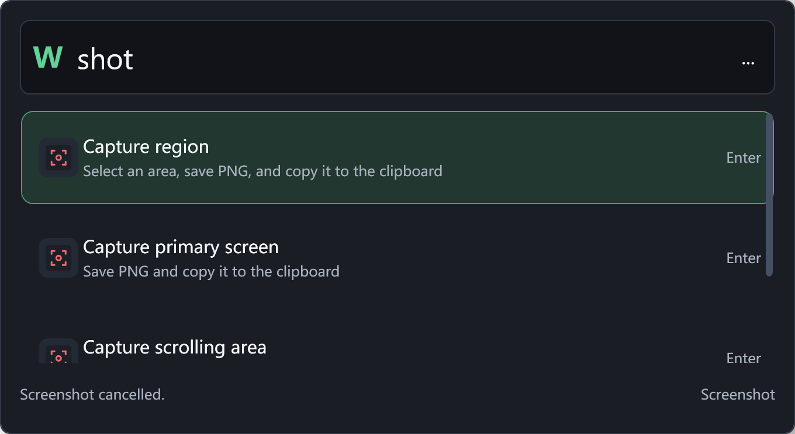
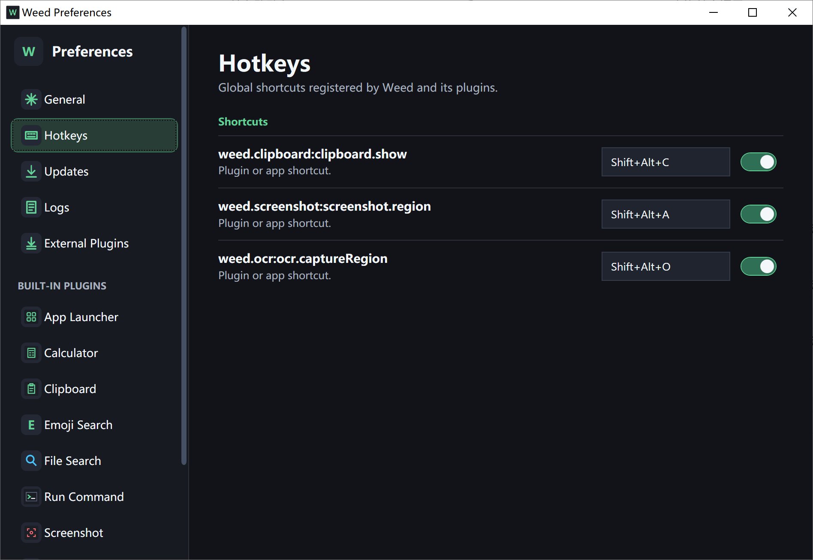
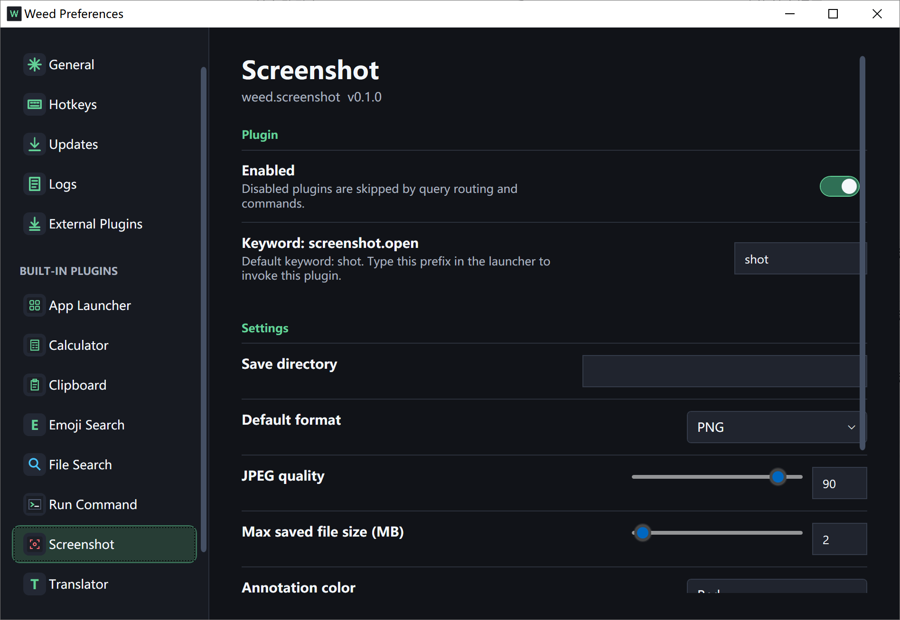

# Weed

Weed is a fast launcher and productivity tool for Windows. Press `Alt+Space` to launch apps, evaluate expressions, search clipboard history, translate text, find files, or start a screenshot from one consistent interface.

## Highlights

- **App launcher:** Find apps by name, pinyin, pinyin initials, or English acronym. Run as administrator, open the containing folder, or copy the target path.
- **Instant calculator:** Enter an expression directly. Common operators, functions, constants, factorials, percentages, and logarithms with custom bases are supported.
- **Clipboard history:** Capture and search text, images, file lists, HTML, and RTF. Pin, delete, copy, or paste previous entries.
- **Screenshots and annotation:** Capture a region, the primary screen, or a scrolling area, then annotate the result.
- **Quick translation:** Translate text with Google Translate or Baidu Translate and configure default languages and proxy behavior.
- **File search:** Search the local Everything index for files and folders.
- **Emoji search:** Find emoji by name, alias, category, or shortcode.
- **System commands:** Open Task Manager, Registry Editor, Services, Control Panel, and other common Windows tools.
- **External plugins:** Import plugins from ZIP packages, DLLs, published folders, or source folders.

## Screenshots

| App Launcher | Calculator |
| --- | --- |
|  |  |
| Clipboard History | Translator |
|  |  |
| OCR | Screenshot Actions |
|  |  |
| Hotkey Settings | Plugin Settings |
|  |  |

## Install

1. Download `Weed-win-x64.zip` from the [latest release](https://github.com/baldwk/Weed/releases/latest).
2. Install the [.NET 9 Desktop Runtime x64](https://dotnet.microsoft.com/download/dotnet/9.0) if it is not already installed.
3. Extract the entire archive to a permanent folder, then run `Weed.App.exe`.

Weed currently supports 64-bit Windows 10 and later. The launcher opens on first run and a tray icon remains available in the notification area. Starting Weed again activates the existing process instead of opening a second instance.

> Weed does not currently ship an installer or a code-signed executable. Download it only from this repository's Releases page and run it after extraction.

## Quick Start

Press `Alt+Space`, enter a query, use the arrow keys to select a result, and press `Enter` to run its default action. Additional actions such as copy, paste, locate, or delete appear in the result hints when available.

| Input | Purpose |
| --- | --- |
| `vscode`, `wx` | Find an app by name, pinyin, or acronym |
| `1+2*3`, `ln(e)`, `log2(8)` | Evaluate an expression |
| `clip meeting` | Search clipboard history |
| `clip type:image` | Show only clipboard images |
| `shot` | Open screenshot actions |
| `tr hello` | Translate with the configured defaults |
| `tr en zh-CN hello` | Specify source and target languages |
| `emoji rocket` | Search emoji |
| `file report.pdf` | Search through Everything |
| `taskmgr` | Open Task Manager |

Default hotkeys:

- `Alt+Space`: Open Weed.
- `Shift+Ctrl+C`: Open clipboard history.
- `Shift+Alt+A`: Start a region capture.
- `Shift+Alt+O`: Capture and recognize text after the OCR plugin is installed.

Hotkeys, theme, launch at startup, plugin state, and plugin-specific options are configurable in Settings.

## Plugins

Weed includes App Launcher, Calculator, Clipboard, Screenshot, Emoji Search, Translator, File Search, and Run Command. See the [built-in plugin guide](Built-In%20Plugins/README.md) for complete usage details.

The repository also contains external OCR and Toolbox plugins that can be packaged and imported separately. See the [OCR plugin guide](External%20Plugins/Weed.Plugins.Ocr/README.md) and [Toolbox plugin guide](External%20Plugins/Weed.Plugins.Toolbox/README.md). External plugins run inside the Weed process, so install only plugins you trust.

## Documentation

- [User Guide](docs/user-guide.md): Daily workflows, settings, updates, data locations, and troubleshooting.
- [Built-In Plugin Guide](Built-In%20Plugins/README.md): Entry points, actions, and settings for every built-in plugin.
- [Documentation Index](docs/README.md): User and developer documentation.
- [Developer Documentation](docs/dev/README.md): Builds, architecture, plugin SDK, and releases.

## License

This repository does not currently include an open-source license. All rights are reserved unless a license is added later.
